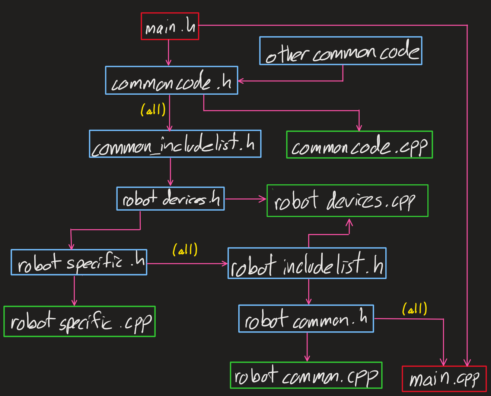

# IVR_High_Stakes
Illini VEX Robotics' source code and libraries for the 2024-2025 Vex High Stakes competition season. Developed using [PROS-Code](https://pros.cs.purdue.edu/) for V5 in [Visual Studio Code](https://code.visualstudio.com/).

### Include Structure
Refer to the following image when including files into the `.h` and `.cpp` files
**NOTE:**
- Robot specific files refers to the files that contain specific subsystems like the intake
- Robot common files refers to files that controls or runs code that encompasses the entire robot like `main.cpp` or the `controls.cpp` 

